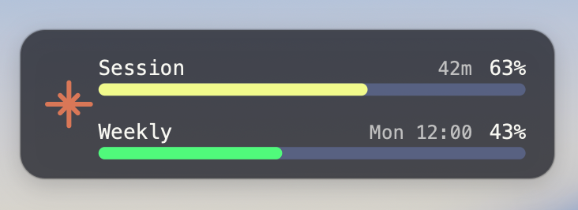
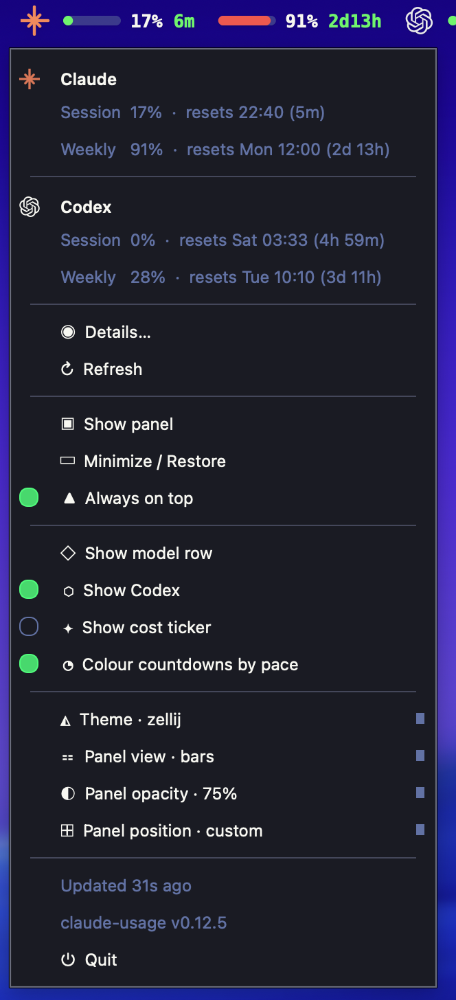

# Claude Usage

A macOS menu-bar app for Claude Code's rate limits: how much of the 5-hour
window and of the weekly cap you have burned, and when each one comes back.
It lives in the menu bar, with an optional always-on-top panel — there is no
window to manage and nothing to open.

<p align="center">
  
  <br>
  
</p>

> A personal fork of [bozdemir/claude-usage-widget](https://github.com/bozdemir/claude-usage-widget).
> Everything that reads the numbers is upstream's work; this fork changes what
> you see and how it is packaged. Upstream's own (much fuller) documentation
> is kept at [docs/UPSTREAM_README.md](docs/UPSTREAM_README.md).

## Why

I used to keep a one-line usage monitor in a terminal pane: two coloured bars
and the reset time, always in the corner of my eye. Changing terminals broke
it, and rebuilding it as a menu-bar script made it something I had to click to
read rather than something I saw. What I wanted back was narrow and specific:

- **Always visible, never in the way.** A readout I never open, never close,
  and never switch to. It has no Dock icon and no ⌘-Tab entry.
- **Two surfaces, same numbers.** The menu bar is enough on a single screen;
  on two, the panel sits in the corner of the second one. Either can be turned
  off without losing the other.
- **The reset time, not just the percentage.** "62%" tells me nothing on its
  own. "62%, back in 51m" tells me whether to start the big refactor now or
  after lunch.
- **Claude first.** Not a dashboard for nine providers. Two windows, two
  bars — plus, if you switch it on, the same two for Codex, because that is
  the other thing I run.
- **Colour that means something.** Green under 60%, yellow under 80%, red
  above — on the bar alone, so the numbers stay readable.

## What it shows

**In the menu bar:** the Claude mark, then each window as a bar, a percentage
and a countdown — 5-hour on the left, weekly on the right. Clicking it opens a
menu with both windows spelled out, including the clock time each one resets
at, and everything below.

**In the panel:** the same two windows as full-width rows. Drag it anywhere;
the scroll wheel makes it wider or narrower — the type stays the same size and
only the bars stretch, so it stays readable at any width. It cannot be resized
into a shape the layout was not built for.

**Codex too, behind a toggle.** *Show Codex* in the menu adds OpenAI's mark
and Codex's own 5-hour and weekly pair after Claude's, on both surfaces —
that is what the menu-bar picture above shows. The numbers come from the
local `codex` CLI (`codex app-server`, polled every five minutes). Off by
default, and nothing runs while it is off.

The menu is grouped: the numbers (details, refresh) · the panel (show/hide,
minimise, always on top) · what it shows (the model-scoped row, Codex, the
cost ticker) · appearance (theme, view, opacity, position).

<p align="center">
  
</p>

## Install

Requires macOS 14+ and [uv](https://docs.astral.sh/uv/) (or pip and Python 3.10+).

```sh
uv tool install --editable .   # the CLI: claude-usage
./build.sh install             # the app
```

`build.sh` builds `Claude Usage.app` with PyInstaller, ad-hoc signs it, copies
it into `/Applications`, and writes a LaunchAgent so it starts at login. It is
PyInstaller rather than a shell wrapper for a specific reason: macOS gives the
Dock and ⌘-Tab the identity of the process it actually launched, and a
framework CPython re-execs itself through its own `Python.app` — so anything
ending in `exec python` shows up as Python, with Python's icon.

The icon is drawn in code; regenerate it with `swift tools/make-icon.swift`.

To remove the login agent:

```sh
launchctl bootout gui/$UID/com.giacorri.claudeusage
rm ~/Library/LaunchAgents/com.giacorri.claudeusage.plist
```

## Where the numbers come from

Unchanged from upstream: Claude Code's own `/api/oauth/usage` endpoint using
the OAuth token Claude Code already stores, with its statusline JSON dump and
the local conversation logs filling in between polls. No separate API key, and
no account of ours anywhere.

## What this fork changes

- **A native `NSStatusItem` readout.** Qt's tray icon asks for a square the
  height of the menu bar, which scaled a wide readout down to a few pixels
  tall; PyObjC is a macOS-only dependency for that reason alone.
- **A `zellij` theme** whose bar walks green → yellow → red with the budget
  instead of staying on one accent.
- **A quieter panel.** No title band — the word "CLAUDE" and a live-tokens
  badge cost a whole row — with the Claude mark in a left gutter instead, and
  reset times sized to be read rather than dimmed into the chrome.
- **Fixed geometry.** `setFixedSize`, and in bars mode the wheel changes the
  width only.
- **A menu-bar-only app** (`LSUIElement`) that starts at login, with its own
  icon and bundle identity.
- **`show_scoped_limit`**: the model-scoped weekly row (Fable, today) is a
  switch in the menu rather than a config-file edit.
- **`osd_click_opens_details`** (default off): a left click on the panel no
  longer throws a 520 px popup over your work.
- **No news ticker.** It fetched a third-party feed for something this widget
  is not for, and the default layout never reserved height for the strip, so
  switching it on painted below the panel's bottom edge.

Everything else — the collector, the popup, the CLI, the API server, the
webhooks, the other themes — is upstream's and still works;
see [docs/UPSTREAM_README.md](docs/UPSTREAM_README.md).

## Licence

MIT, as upstream — copyright for the original work stays with Burak
([bozdemir](https://github.com/bozdemir/claude-usage-widget)).
